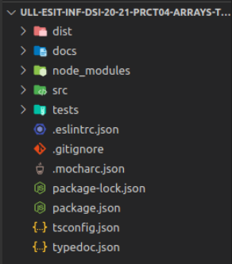
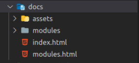
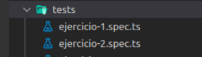
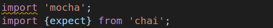
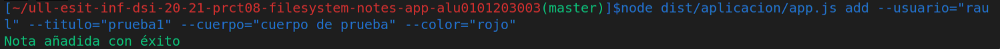
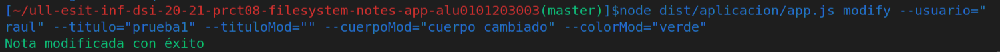
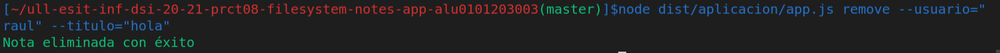
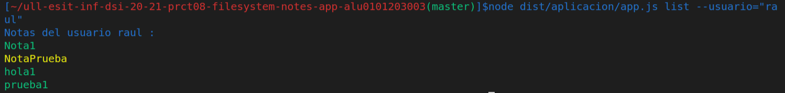
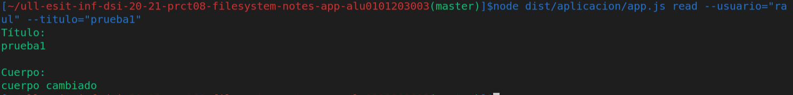

# Práctica 8: Aplicación de procesamiento de notas de texto. Informe.
## Desarrollo de Sistemas Informáticos 
## Raúl Martín Rigor - alu0101203003@ull.edu.es

### Introducción

En este informe se resumen las actividades realizadas en la **práctica 8** para poner en práctica nuestros conocimientos de TypeScript sobre Node.js para trabajar de manera asíncrona en la creación de ficheros a través de la implementación de distintas funciones en un ejercicios. En esta práctica tambien haremos uso de los principios SOLID en la medida de lo posible.

### Objetivos

Al finalizar la práctica, habremos completado los siguientes objetivos:

* Crear y manipular con soltura ficheros con la API asíncrona de Node.js
* Usar correctamente el paquete yargs para comandos
* Usar correctamente el paquete yargs para cambio de color en texto
* Diseñar una aplicación funcional capaz de usar y compaginar las herramientas anteriores

### 1. Creación y configuración del driectorio del proyecto.

#### 1.1. Estructura inicial

Para la creación de la estructura inicial, seguiremos los mismos pasos que en practicas anteriores ([práctica 4](https://github.com/ULL-ESIT-INF-DSI-2021/ull-esit-inf-dsi-20-21-prct04-arrays-tuples-enums-alu0101203003/blob/gh-pages/index.md)).

La estructura debería quedar similar a las siguientes fotos:

  

#### 1.2. Organización de los ejercicios

Será necesario implementar las clases del ejercicio en ficheros diferentes. Los ficheros que dependan de otros (o de otros paquetes) requeriran de un `import` del recurso que necesiten:

 

#### 1.3. Testing y cubrimiento de código

Se usarán tres nuevas herramientas (a través de GitHub Actions) para tener constancia de los resultados de las pruebas y del cubrimiento de código. Serán instaladas con la ayuda de sus respectivos tutoriales (Tests de Node.js, Coveralls y SonarCloud)

### 2. Ejercicio

Paso a explicar la resolución del ejercicio y a adjuntar su código y expectativa. Se mostrará una versión simplificada del enunciado del ejercicios (para verlos al completo con aclaraciones y pistas, consultar la [guía de la práctica](https://ull-esit-inf-dsi-2021.github.io/prct08-filesystem-notes-app/).

(Para poder acceder a los atributos privados que creemos en las clases usaremos funciones *set* y *get*, las cuales se pueden encontrar en el código fuente.)

Para poder resolver este ejercicio nos serán de utilidad ciertas herramientas de los paquetes [yargs](https://www.npmjs.com/package/yargs) y [chalk](https://www.npmjs.com/package/chalk), los cuales debemos instalar con sus correspondientes dependencias para el manejo de comandos y el color del texto. También será de vital importancia instalar el paquete `@types/node` para utilizar las APIs de [Node.js](https://nodejs.org/en/).

El ejercicio se basa en una aplicación de procesamiento de notas de texto. Mediante comandos, los distintos usuarios podrán añadir, modificar, eliminar, listar y leer notas de manera asíncrona. 

La estructura del código del ejercicio está compuesta por los siguientes elementos:
* Un fichero con la clase **Nota**
* Un fichero con la clase **Usuario**
* Un fichero con los **comandos** de la aplicación y su manejo

La clase Nota permite crear notas con sus propiedades (Título, Cuerpo y Color) que serán usadas por las funciones de la clase Usuario:

```ts
export class Nota {
    /**
     * Constructor
     * @param titulo titulo de la nota
     * @param cuerpo cuerpo de la nota
     * @param color color de la nota
     */ 
    constructor(private titulo :string, private cuerpo :string, private color :string) {}
```

La clase Usuario es de gran importancia ya que en ella se realizan todas las funciones de la aplicación. Esta clase está íntimamente relacionada con la estructura de directorios para el almacenamiento de las notas (en el propio constructor de un Usuario se comprobará si ya existe un directorio asignado a su nombre y se creará si no se da ese caso. En este directorio personal del usuario se almacenarán todas sus notas)

```ts
export class Usuario {
    /**
     * Constructor
     * @param nombre del usuario
     */ 
    constructor(private nombre :string) {
        if (!this.existeUsuario(this.nombre)){
            fs.mkdirSync(`src/aplicacion/notas/${this.nombre}`);
        }
    }
```

Para hacer este tipo de comprobaciones, se implementan dos funciones ( `existeUsuario()` y `existeNota()` ): 

```ts
    /**
     * Función existeUsuario.
     * Permite comprobar si está creado el directorio del usuario
     * @param nombre del usuario
     */ 
    public existeUsuario (nombre :string){
        if (fs.existsSync(`src/aplicacion/notas/${nombre}`)){
            return true
        } else {
            return false
        }
    }
    
    /**
     * Función existeNota.
     * Permite comprobar si está creada la nota dentro del directorio del usuario
     * @param nombre del usuario
     * @param titulo de la nota
     */ 
    public existeNota (nombre :string, titulo :string){
        if (fs.existsSync(`src/aplicacion/notas/${nombre}/${titulo}.json`)){
            return true
        } else {
            return false
        }
    }
```

Otra función que nos será de utilidad es la de colorear texto, ya que nos permitirá darle color a las notas a la hora de leerlas según su atributo:

```ts
public colorear (texto :string, color :string){
        var resultado = "";
    
        switch (color){
            case "rojo":
                resultado = chalk.red(`${texto}`)
                break;
            case "verde":
                resultado = chalk.green(`${texto}`)
                break;
            case "azul":
                resultado = chalk.blue(`${texto}`)
                break;
            case "amarillo":
                resultado = chalk.yellow(`${texto}`)
                break;
            default:
                break;
        }
    
        return resultado
    }
```

En el fichero de la app nos encontraremos los comandos y sus correspondientes manejadores que harán sus correspondientes llamadas a las funciones de la clase Usuario que nos permitirán añadir, modificar, eliminar, listar y leer notas de un usuario:

```ts
/**
 * Comando add.
 * Añade una nota al directorio del usuario
 */
 yargs.command({
    command: 'add',
    describe: 'Añade una nueva nota',
    builder: {
      usuario: {
        describe: 'Nombre del usuario',
        demandOption: true,
        type: 'string',
      },
      titulo: {
        describe: 'Titulo de la nota',
        demandOption: true,
        type: 'string',
      },
      cuerpo: {
        describe: 'Cuerpo de la nota',
        demandOption: true,
        type: 'string',
      },
      color: {
        describe: 'Color de la nota',
        demandOption: true,
        type: 'string',
      },
    },
    handler(argv) {
      if (typeof argv.usuario === 'string' && typeof argv.titulo === 'string' && typeof argv.cuerpo === 'string' && typeof argv.color === 'string') {
        var usuario = new Usuario(argv.usuario);
        usuario.añadirNota(argv.titulo, argv.cuerpo, argv.color);
        
      } else {
        console.log(chalk.red("Error. Comando mal especificado"));
      }
    },
  });

/**
 * Comando modify.
 * Modifica una nota al directorio del usuario
 */
 yargs.command({
  command: 'modify',
  describe: 'Modifica una nota',
  builder: {
    usuario: {
      describe: 'Nombre del usuario',
      demandOption: true,
      type: 'string',
    },
    titulo: {
      describe: 'Titulo de la nota',
      demandOption: true,
      type: 'string',
    },
    tituloMod: {
      describe: 'Titulo nuevo de la nota',
      demandOption: true,
      type: 'string',
    },
    cuerpoMod: {
      describe: 'Cuerpo nuevo de la nota',
      demandOption: true,
      type: 'string',
    },
    colorMod: {
      describe: 'Color nuevo de la nota',
      demandOption: true,
      type: 'string',
    },
  },
  handler(argv) {
    if (typeof argv.usuario === 'string' && typeof argv.titulo === 'string' && typeof argv.tituloMod === 'string'&& typeof argv.cuerpoMod === 'string' && typeof argv.colorMod === 'string') {
      var usuario = new Usuario(argv.usuario);
      usuario.modificarNota(argv.titulo, argv.tituloMod, argv.cuerpoMod, argv.colorMod);
      
    } else {
      console.log(chalk.red("Error. Comando mal especificado"));
    }
  },
});

```

A continuacíon se pasan a explicar las funciones más relevantes de la clase Usuario (las que serán llamadas por comandos) en los siguientes apartados:

#### 2.1 añadirNota

La función añadirNota permite añadir una nota en el directorio del usuario recibiendo mediante comandos el titulo, cuerpo y color de la nota a añadir. La nota será escrita en formato JSON.

```ts
public añadirNota(titulo :string, cuerpo :string, color :string){
        if (this.existeNota(this.nombre,titulo)){
            console.log(chalk.red("Error. La nota ya existe"));
        } else {
            var nota = new Nota(titulo,cuerpo,color);
            var notaFormateada = nota.formatear();
            fs.writeFile(`src/aplicacion/notas/${this.nombre}/${titulo}.json`, notaFormateada, () => {
                console.log(chalk.green('Nota añadida con éxito'));
            });
        }
    }
```

 

#### 2.2 modificarNota

La función modificarNota permite modificar una nota en el directorio del usuario recibiendo mediante comandos el titulo de la nota a modificar, el titulo modificado, el cuerpo modificado y color el color modificado de la nota. No es necesario modificar todos los parámetros, cuando se le pase un parámetro vacío la función interpretará que ese parámetro no se modifica. Cuando se cambie el título, se renombrará también el fichero.

```ts
public modificarNota(titulo :string, tituloMod :string, cuerpoMod :string, colorMod :string){
        if (!this.existeNota(this.nombre,titulo)){
            console.log(chalk.red("Error. La nota no existe"));
        } else {
            var nota = fs.readFileSync(`src/aplicacion/notas/${this.nombre}/${titulo}.json`);
            var notaParseada = JSON.parse(nota.toString());
            var notaMod = new Nota(notaParseada.titulo,notaParseada.cuerpo,notaParseada.color);

            if (tituloMod !== ""){
                notaMod.setTitulo(tituloMod);
                fs.renameSync(`src/aplicacion/notas/${this.nombre}/${titulo}.json`, `src/aplicacion/notas/${this.nombre}/${tituloMod}.json`);
            }
            
            if (cuerpoMod !== ""){
                notaMod.setCuerpo(cuerpoMod);
            }

            if (colorMod !== ""){
                notaMod.setColor(colorMod);
            }

            fs.writeFile(`src/aplicacion/notas/${this.nombre}/${notaMod.getTitulo()}.json`, notaMod.formatear(), () => {
                console.log(chalk.green('Nota modificada con éxito'));
            });
        }
    }
```
 

#### 2.3 eliminarNota

La función eliminarNota permite eliminar una nota del directorio del usuario recibiendo mediante comandos el titulo de la nota a eliminar. Hará uso de la función rm para borrar el fichero asociado a la nota indicada (Advertencia: la función rm da problemas en las pruebas con versiones antiguas de node.js)

```ts
    public eliminarNota(titulo :string){
        if (!this.existeNota(this.nombre,titulo)){
            console.log(chalk.red("Error. La nota no existe"));
        } else {
            fs.rm(`src/aplicacion/notas/${this.nombre}/${titulo}.json`, () => {
                console.log(chalk.green('Nota eliminada con éxito'));
            });
        }
    }
```
 

#### 2.4 listarNotas

La función listarNotas permite mostrar todas las notas del directorio del usuario con sus colores correspondientes.

```ts
    public listarNotas(){
        console.log(`Notas del usuario ${this.nombre} :`);

        fs.readdirSync(`src/aplicacion/notas/${this.nombre}`).forEach((item) => {
            var nota = fs.readFileSync(`src/aplicacion/notas/${this.nombre}/${item}`);
            var notaParseada = JSON.parse(nota.toString());
            var titulosColoreados :string = this.colorear(notaParseada.titulo,notaParseada.color);
            console.log(titulosColoreados)
        });
    }
```
 

#### 2.5 leerNota

La función leerNota permite leer una nota del directorio del usuario formateada con su color correspondiente (Se mostrará, con dicho color, el título y el cuerpo de la nota). Recibirá como parámetro el título de la nota a leer.

```ts
     public leerNota(titulo :string){
        if (!this.existeNota(this.nombre,titulo)){
            console.log(chalk.red("Error. La nota no existe"));
        } else {
            var nota = fs.readFileSync(`src/aplicacion/notas/${this.nombre}/${titulo}.json`);
            var notaParseada = JSON.parse(nota.toString());
            var notaColoreada :string = this.colorear(`Título:\n${notaParseada.titulo}\n\nCuerpo:\n${notaParseada.cuerpo}`,notaParseada.color);
            console.log(notaColoreada)
        }
    }
```
 

### Conclusiones

Con esta práctica he aprendido una nueva herramienta de trabajo (Node.js) para la escritura y lectura de ficheros que, con seguridad, será muy útil para cualquiera de mis actuales y siguientes desarrollos. 
También he aprendido a usar las github Actions para el testing y el cubrimiento de código, las cuales brindan una valiosa información sobre mi proyecto.

### Bibliografía

A continuación se muestra una serie de recursos que han sido de gran utilidad para la realización de la práctica y de este informe:

Recurso| Dirección
-------|----------
Guía de la práctica | https://ull-esit-inf-dsi-2021.github.io/prct08-filesystem-notes-app/
Apuntes | https://ull-esit-inf-dsi-2021.github.io/typescript-theory/typescript-generics.html
yargs | https://www.npmjs.com/package/yargs
chalk | https://www.npmjs.com/package/chalk
